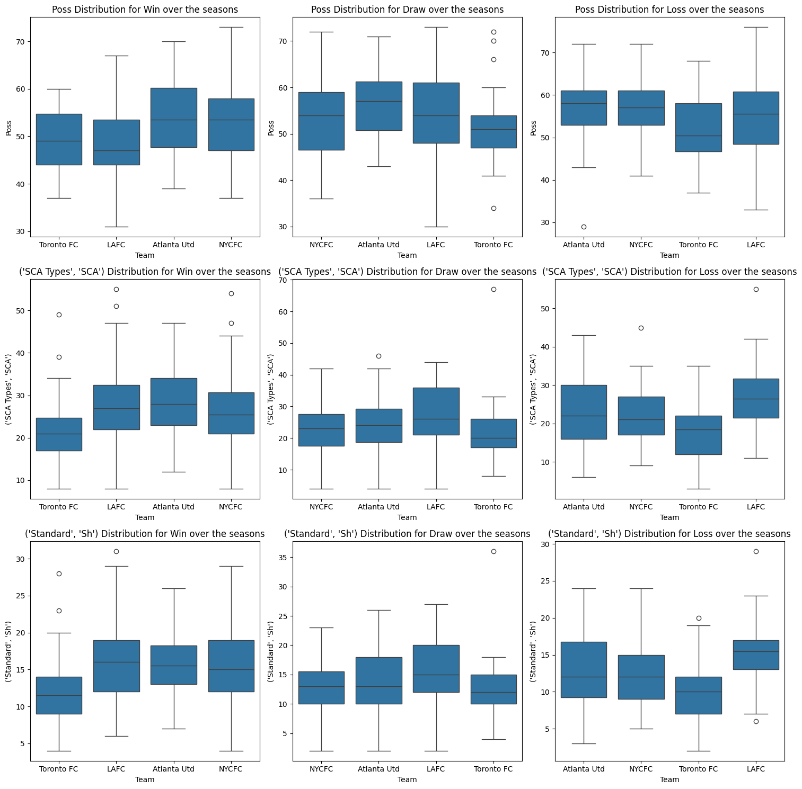
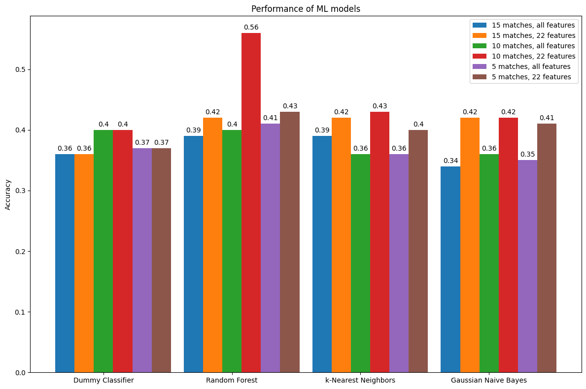

# Evaluation of machine learning techniques for football score prediction in MLS

Gabriel Masella \[SM3800048\], M.Sc student of "Data Science and AI", *University of Trieste*, Italy  
Course of A.A. $2023/2024$ - Introduction to Machine Learning  
25th June 2024

## Problem statement

Consider a hypothetical scenario where we seek to expand beyond the European market as a newly established sports betting enterprise. The business offers AI-based services, including exclusive prediction based on ML algorithms and strong data analysis.  
*Major League Soccer (MLS)* has made considerable investments over the last few years and is becoming more widely known, with several high-profile players joining the league at the end of their careers, including *Lionel Messi* and *Luis Suárez*.  
One additional reason to consider this expansion is that, in contrast to the European football season, the Major League Soccer season in the United States starts in February and ends in December, with matches played throughout the year. The goal of this project is to develop machine learning models that can be integrated into our platform.  
These models will be trained on the average statistics obtained from the website [*FBRef.com*](https://fbref.com/en/) for the two teams in their most recent matches and the outcome of these predictions will be classified as either a win, a loss, or a draw.  
In a more formal way we can write:
$$f'_{predict}: (X\subset\mathbb{R}^p) \times M \rightarrow{} Y=\{W, D, L\}$$
where $p$ represents the number of the features, that will be discussed subsequently, and $M$ is the set of all the possible models.

## Assessment and performance indexes

It is a well-established principle in theory that, in the context of *multiclass classification*, the best performance index for the confrontation between models is the *accuracy* on a test dataset.  
To establish a lower bound, the so-called *dummy classifier* is considered in addition to the other supervised machine learning techniques.

## Proposed solution

Before embarking on this project, it is crucial to select the relevant statistical data from the extensive FBRef dataset. We have opted to collect data from all teams participating in matches from the 2019 season onwards (except for the 2020 season, the year of the global pandemic).

The features selected, divided by type according to this [example page](https://fbref.com/en/squadre/46024eeb/2024/partite/c22/schedule/Risultati-e-partite-Philadelphia-Union-Major-League-Soccer), are a subset around 60 features overall, for each match and each team.  
In the figure, the box plot presented here considers four key features for the categories of win, draw, and loss: the possession, shot, and shot-creating action (SCA) variables.  
A sample of four teams from the 29 present in the MLS, was selected for analysis because they represent a variety of different strengths. As we can see, it's difficult to build manually an $f_{predict}$.  
This paper has selected the following ML techniques for analysis: Random Forest, k-nearest Neighbors, and Gaussian Naive-Bayes.

## Experimental evaluation

### Data

The initial dataset consists of a set of features for each match played by each team in each season. The first step is to calculate the average of all features for $n$ matches, where in this project $n\in\{5,10,15\}$.  
An additional feature is implemented in the system to calculate the *Elo Ratings* of football clubs. The *Elo Rating*, a method originally developed for chess, is used to measure the relative skill of players playing against each other. The system, which is based on a simplified version of the one proposed on the [website](http://clubelo.com/System), begins with each club having an initial *Elo Rating* of 1500 in 2015.  
After each match, clubs' ratings are updated based on the outcome of the match, the margin of victory, and the difference in ratings between the clubs[^1].  
The pre-processed dataset has a total dimension of $p=122$ features, which is doubled because we take the average statistics for both teams. For $n=5$, there are $1494$ matches to analyse, $n=10$ has $1416$ matches, and for $n=15$, there are $1338$ matches.

### Procedure

In the process of developing machine learning models for this project, three distinct algorithms were selected: Random Forest Classifier, k-nearest Neighbors, and Gaussian Naive Bayes. Each model was initiated with specific hyperparameters.  
For the Random Forest Classifier, the hyperparameters selected for tuning included $n_{estimators}=\{25, 50, 75, 100, 250, 500, 750, 1000\}$, the maximum number of features considered at each split (with options being None, $\sqrt{p}$, or $\log_2(p)$), and the maximum depth of the trees $max_{depth}= \{\text{None}, 1, 5, 10, 15, 25, 35, 50\}$.  
The hyperparameters selected for tuning the k-Nearest Neighbours model included the number of neighbors (ranging from 1 to 100), the weight function used in prediction (either \"uniform\" or \"distance\"), the distance metric used for the tree (options being \"Euclidean\", \"Manhattan\", or \"Minkowski\"), the algorithm used to compute the nearest neighbors ($"ball \ tree"$, $"kd \ tree"$, or $"brute"$), and the leaf size passed to the first two algorithms.  
The Gaussian Naive Bayes model was initiated with no specific parameters and no hyperparameters were selected for tuning in this model because from theory we know there is no possible hyperparameter to fix.  
The data was divided into two distinct sets: a training set and a testing set. The training set comprised data from the $2019$ season to the $2023$ season, while the testing set consisted of data from the $2024$ season, which comprised $199$ matches. This represents approximately $15/20\%$ of the total dataset.  
The code employs Stratified K-Fold Cross Validation (CV) with $n_{splits}=5$, which entails the data set divided into five folds. In each iteration, one fold is designated for testing purposes, while the remaining four folds are employed for training. This process is repeated five times in order to evaluate training performances. The use of stratified K-fold cross-validation (CV) ensures that the relative class frequencies are approximately preserved in each training and validation fold, thereby making it a suitable approach for classification models. This approach helps to avoid overfitting and provides a more robust estimate of the model performance.  
Subsequently, a different approach was employed, in which the models were executed with a condensed set of the 22 most pertinent features (Elo rating, numbers of defenders, midfielders, and forwards in formation, average possession, goal for, goal against, shot-creating actions, goal-creating actions, and shots in the last $n$ matches) to determine if there would be a performance improvement.

### Results and discussion

Once all training and testing procedures have been completed, it is now possible to evaluate the performance of all models provided as hyperparameters $n\in\{5,10,15\}$ and $p\in\{22, 122\}$.

As illustrated in Figure 1, the Random Forest learning technique demonstrated superior performance compared to other approaches, with the highest accuracy observed when using the average of the 22 features in 10 matches, which had hyperparameters set to $max_{depth}= 5$, $max_{features}=\sqrt{p}$ and $n_{estimators}=100$.  
This results indicate that, on average, the use of fewer, more important features leads to better performance than the use of a larger number of features that are less important. This suggests that the completeness of data is not necessarily indicative of better performance.  
Another noteworthy aspect is that, regardless of the number of matches, when all features are considered independently, the classifier will invariably perform worse than the dummy classifier. This is a suboptimal outcome for our models and provides a justification for not employing them in this context.

[^1]: The system also takes home advantage into account, with a constant of $50$ elo points for the home team, while the weight index in $\Delta Elo_{1X2}$ is set to $k=25$
